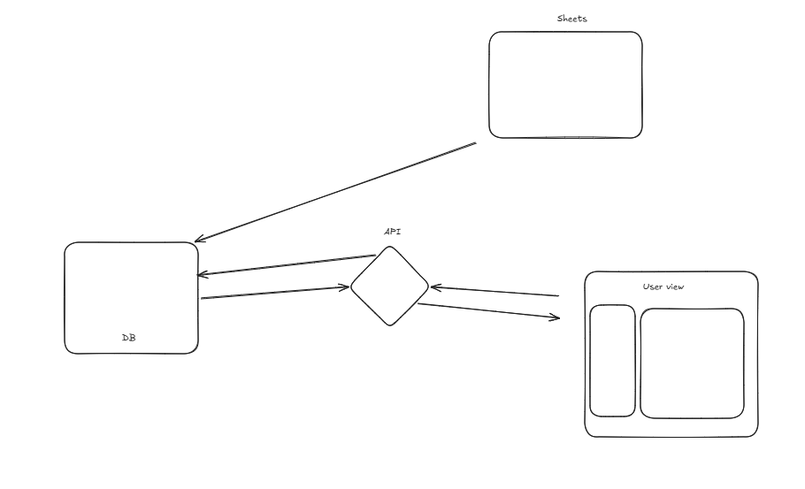

## Por qué del proyecto?

Necesito una herramienta que me facilite la gestion de los precios y el compartir esta informacion de manera rápida con los clientes
Creamos una interfaz mucho mas rápida y accesible que un block de notas o la informacion del sistema administrativo Valery
De momento catalogo este proyecto como: "Un catalogo interactivo" o un "Catalogo con esteroides"

## Requisitos de la app

[] mejorar agilidad para obtener la informacion y los precios actuales de los productos
[] aumentar el tiempo de respuestas de solicitud de cotizacion

## otros requisitos

[] crear productos compuestos para trabajar sobre la base del valery
[] ordenar por secciones o colecciones los productos

## posibles mejoras a futuro

[] dividir la interfa del usuario final con la del administrador del negocio
[] permitir la operabilidad via online

## Funcionalidad y estado actual de la App

- Nos conectamos a google sheets para hacer la carga de los productos con atributos como: ID, valery_name, description, price
- El front muestra junto con un buscador simple las tarjetas que contienen la informacion del producto
- sistema de colecciones que permite guardar conjuntos de productos para facilitar acceso

## Cosas a mejorar

- No se han añadido imagenes a los elementos
- Los elementos pineados no actualizan su informacion cuando se refresca la data obtenido del origen externo
- No podemos crear productos compuestos
- No hay facilidad de edicion de la descripcion de los productos, esta se debe hacer directamente sobre el google sheets

